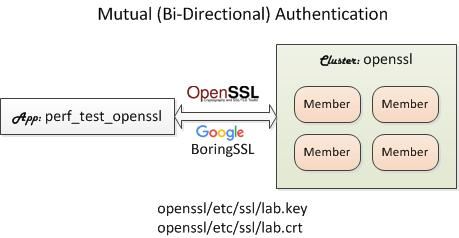

# IMDG Cluster: openssl

As part of the TLS/SSL lab of Hazelcast Operations Training, this bundle includes the `openssl` cluster preconfigured to enable OpenSSL/BoringSSL.

## Installing Bundle

```bash
install_bundle -download bundle-hazelcast-training-3-app-perf_test_openssl-cluster-openssl
```

## Use Case

*This bundle is for training use only.* As part of the OpenSSL lab, this bundles includes a cluster and an app configured with a private key and a trusted certificate.



## Private Key and Trusted Certificate

This distribution contains the following self-signed 4096-bit private key and trusted certificate files expiring on May 26, 2030.

```bash
switch_cluster openssl
tree etc/ssl
```

```console
etc/ssl
├── lab.crt
└── lab.key
```

They are created by executing the following `openssl` command.

```bash
openssl req -newkey rsa:4096 -x509 -sha256 -days 3650 -nodes -out lab.crt -keyout lab.key -subj "/CN=*.demo.com"
```

To check the certificate content, execute the following.

```bash
openssl x509 -in etc/lab.crt -text
```

The certficate is created for the domain name `demo.com` and hence you must set the domain name for your machine. This is done by defining host names with the domain name in the `/etc/hosts` file, which requires root acccess.

**Unix:**

```bash
sudo vi /etc/hosts
```

**Windows:**

```dos
notepad %windir%\system32\drivers\etc\hosts
```

Add the following line with `server1`, `server2`, and `server3` as host names for the three (3) cluster members.

```bash
# Example. Replace the IP address with your machine's IP address and "mymachine" to your machine's host name.
192.168.1.6 mymachine server1.demo.com server2.demo.com server3.demo.com
```

## Building `openssl` Cluster

If the bundle does not include openssl binaries in the lib directory then you must run the `build_app` script to download the binaries.

```bash
switch_cluster openssl
cd bin_sh
./build_app
```

## Starting Cluster

```bash
# Add members. Bundles do not include members.
add_member; add_member

# Start cluster
start_cluster

# See SSL messages in the log file
show_log
```

## Starting Client

```bash
cd_app perf_test_openssl
cd bin_sh
./test_ingestion -run
```

The SSL debug is enabled for the `perf_test_openssl` app, i.e., `-Djavax.net.debug=SSL` (see `setenv.sh`). You should see SSL debug outputs in the shell console.

## Tearing Down

```bash
stop_cluster
```
